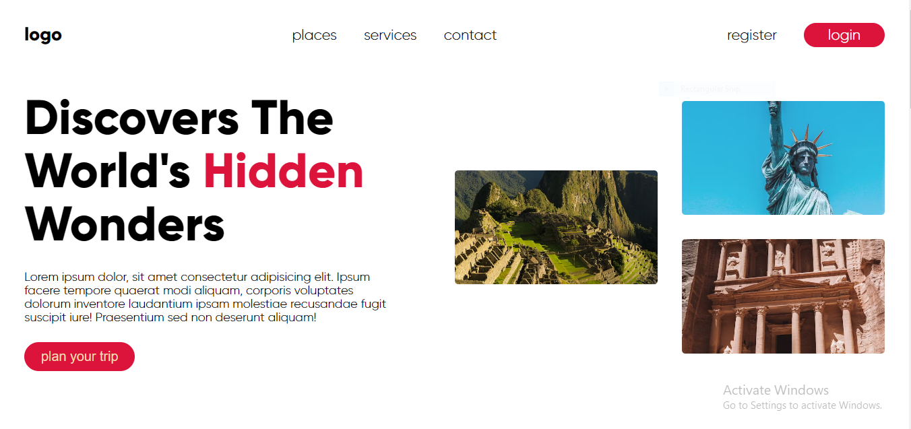
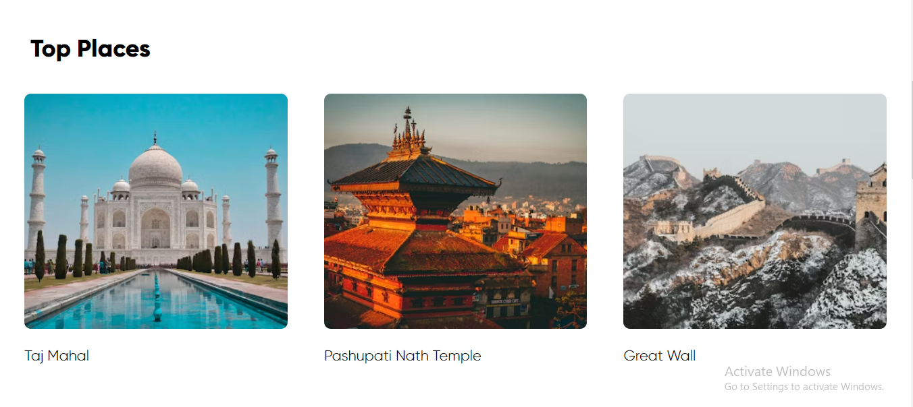
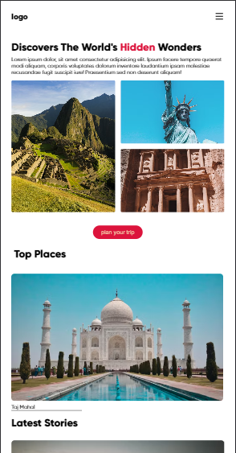
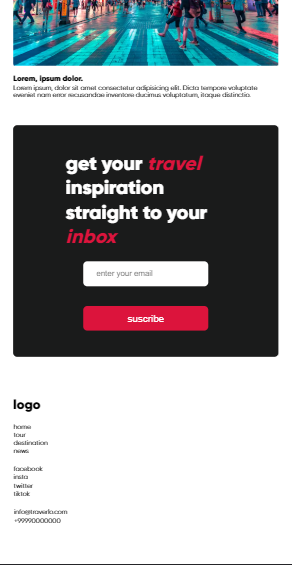

Travel Explorer

A responsive travel-themed website that showcases stunning destinations, top cities, and the latest travel stories. Designed with HTML and SCSS for a modern and clean user experience.

📸 Features

Responsive Design — Optimized for mobile, tablet, and desktop.

Hero Section — Eye-catching headline with engaging images.

Navigation Bar — Adaptive navbar with a hamburger menu for mobile.

Top Cities Section — Horizontally scrollable city highlights.

Latest Stories — Detailed travel stories with images and descriptions.

🖼️ Project Preview

## Live Demo

[View Online](https://gdhiraj030.github.io/travel-responsive-website/)

🛠️ Built With

HTML5 — Semantic structure

SCSS — Modular and responsive styling

Flexbox & CSS Grid — For responsive layouts

⚡ How to Run the Project

Clone the repository:

git clone <https://github.com/gdhiraj030/travel-responsive-website.git>

Navigate to the project folder:

cd travel-explorer

Open index.html in your browser.

This project is licensed under the MIT License [License](LICENSE).

🤝 Connect

GitHub: <https://github.com/gdhiraj030>
